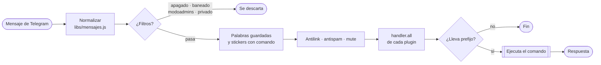

<!-- ══════════════════ PORTADA ══════════════════ -->

<table width="100%">
<tr>
<td width="34%" align="center" valign="middle">


<sub>💜 <b>La Suki</b> · edición Telegram</sub>

</td>
<td width="66%" valign="middle">

<h1>⚡ LA&nbsp;SUKI&nbsp;BOT · TELEGRAM</h1>


El bot que corría en WhatsApp con Baileys, **reescrito de cero para la Bot API
de Telegram**. Un token de [@BotFather](https://t.me/BotFather), `npm start`, y
ya tienes tus 525 comandos andando.

<a href="#-01--instalación-en-2-minutos"></a>
<a href="https://youtu.be/xH_gQrqw4HI"></a>
<a href="https://dash.skyultraplus.com"></a>

</td>
</tr>
</table>

<p align="center">


</p>

---

## 🧭 Índice

|  | Sección | De qué va |
|:--:|:--|:--|
| **01** | [Instalación en 2 minutos](#-01--instalación-en-2-minutos) | BotFather, token y arranque |
| **02** | [Pterodactyl](#-02--pterodactyl) | Egg, variables y detalles del hosting |
| **03** | [Prefijos](#-03--prefijos) | `.` `#` `/` y cómo cambiarlos (sí, con emojis) |
| **04** | [Dueños y accesos](#-04--dueños-y-accesos) | `.soyowner`, `.addowner`, quién le habla en privado |
| **05** | [Catálogo de comandos](#-05--catálogo-de-comandos) | Los 525, por categorías |
| **06** | [Cómo funciona por dentro](#-06--cómo-funciona-por-dentro) | El recorrido de un mensaje y la estructura |
| **07** | [Qué cambia respecto a WhatsApp](#-07--qué-cambia-respecto-a-whatsapp) | Lo que se fue y lo que llegó |
| **08** | [Si algo falla](#-08--si-algo-falla) | Los cinco problemas de siempre |
| **09** | [Hosting, créditos y comunidad](#-09--hosting-créditos-y-comunidad) | Sky Ultra Plus y los grupos |

---

## ⚙️ Lo que trae

<table>
<tr>
<td width="33%" valign="top">

#### 📥 Descargas
YouTube · TikTok · Instagram · Facebook · Twitter · Spotify · MediaFire · APKs.
El bot **baja el archivo él mismo** y lo sube a Telegram.

</td>
<td width="33%" valign="top">

#### 🎨 Stickers
De foto, de video y de GIF. **54 efectos** con botones, `.qc`, emojis animados
y stickers con comando propio.

</td>
<td width="33%" valign="top">

#### 🧠 Inteligencia artificial
ChatGPT, Gemini, Groq, generación de imágenes, mejora de calidad y voz.
`.chat on` y responde sola en el grupo.

</td>
</tr>
<tr>
<td valign="top">

#### 👮 Administración
Antilink, antispam, mute con tiempo, bienvenidas con imagen, apertura y cierre
del grupo por horario.

</td>
<td valign="top">

#### 💾 Multimedia guardada
`.guar <palabra>` y el bot manda ese archivo cada vez que alguien escriba la
palabra. Con copia local de respaldo.

</td>
<td valign="top">

#### 🎮 Juegos y RPG
Economía, clanes, mascotas, batallas, verdad y reto, y los modos `.4vs4`
hasta `.24vs24`.

</td>
</tr>
</table>

---

## 🚀 01 · Instalación en 2 minutos


**Paso 1 — Crea el bot**

Abre Telegram, busca **@BotFather**, envía `/newbot` y ponle nombre y usuario.
Te devuelve un token parecido a `123456789:AAE...`.

**Paso 2 — Ábrele los ojos** ⚠️

> [!IMPORTANT]
> Sin este paso el bot **solo ve los mensajes que empiezan con `/`**: no
> funcionarían el antilink, las palabras guardadas ni los stickers con comando.

```
En @BotFather:
  /setprivacy      →  elige tu bot  →  Disable
  /setjoingroups   →  Enable
```

**Paso 3 — Arranca**

```bash
git clone https://github.com/russellxz/LA-SUKI-BOT-TELEGRAM.git
cd LA-SUKI-BOT-TELEGRAM
npm install
npm start
```

Si no pusiste el token en una variable, el bot te lo pide por consola y lo
guarda en `token.json`.

**Paso 4 — Hazte dueño**

Al arrancar sin dueños la consola te da un código:

```
⚠️  Todavía no hay ningún dueño configurado.
   Escríbele al bot por privado:  .soyowner 483920
```

Le mandas ese comando **por privado** y quedas registrado en `owner.json`.
El código sirve una sola vez.

---

## 🦖 02 · Pterodactyl

| Paso | Qué hacer |
|:--|:--|
| **Egg** | NodeJS, versión **20 o superior** |
| **Archivos** | Sube el bot o clona el repo dentro del servidor |
| **Arranque** | `npm start` |

**Variables (pestaña *Startup*)**

| Variable | Valor | ¿Obligatoria? |
|:--|:--|:--:|
| `BOT_TOKEN` | el token de @BotFather | ✅ |
| `OWNER_ID` | tu ID de Telegram | recomendada |
| `API_BASE` · `API_KEY` | otro servidor de APIs de descarga | opcional |
| `NEOXR_BASE` · `NEOXR_KEY` | la API de respaldo (Instagram, audio de YouTube) | opcional |
| `CDN_URL` | otro servidor para `.tourl` | opcional |

> [!TIP]
> Si tu egg no deja crear variables, el bot también lee el token de `token.json`.

**Detalles del hosting**

- **Nada nativo que compilar.** La base de datos es JSON puro y las imágenes
  usan `@napi-rs/canvas`, que ya trae binarios listos.
- **ffmpeg es opcional.** Sin él funcionan los stickers de imagen y todo lo
  demás; solo se pierden los stickers animados y las conversiones de audio.
  Si tu egg lo permite: `apt update && apt install -y ffmpeg`.
- **Un token = un bot.** Dos servidores con el mismo token dan error 409, y el
  bot te lo dice claramente.
- **Disco:** `guar_media/` guarda las copias de `.guar`; `tmp/` se limpia sola
  cada 15 minutos.

---

## 🔣 03 · Prefijos

De fábrica el bot responde a tres:

<p>
<kbd> .menu </kbd>&nbsp;&nbsp;<kbd> #menu </kbd>&nbsp;&nbsp;<kbd> /menu </kbd>
</p>

El `/` es el prefijo nativo de Telegram y **siempre queda activo**. En grupos
también funciona `/comando@TuBot`, que es como Telegram manda los comandos.

Para cambiarlos (solo el dueño):

```
.setprefix . # !      →  deja activos  .  #  !  y  /
.setprefix 🔥 ✨       →  sí, también valen emojis:  🔥menu
.setprefix reset      →  vuelve a los de siempre
.setprefix            →  muestra los actuales
```

> [!NOTE]
> Se aceptan símbolos y emojis (hasta 4 caracteres visibles). **No** se aceptan
> letras ni números: cualquier palabra suelta dispararía comandos. El cambio es
> inmediato y se guarda en `prefijos.json`.

---

## 👑 04 · Dueños y accesos


**Agregar más dueños** — con `.addowner`, de cualquiera de estas formas:

```
.addowner                  (respondiendo a un mensaje suyo)
.addowner @usuario
.addowner 123456789        (su ID; lo ve con .id)
```

Para quitarlo, `.delowner` igual. No se puede quitar al único dueño que quede.

**Quién puede escribirle por privado**

Por seguridad, **en privado el bot solo responde a los dueños y a quien esté en
la lista de acceso**. Así, si alguien encuentra tu bot por su @usuario, no puede
usarlo por su cuenta. En **grupos no aplica**: ahí responde a todos.

```
.addlista     (respondiendo, con @usuario o con su ID)  →  le das acceso
.dellista     →  se lo quitas
.addlista     (sin nada) →  muestra la lista completa
```

> [!NOTE]
> Mientras no haya ningún dueño configurado el filtro no se aplica: si no, no
> podrías mandar `.soyowner` para reclamar el bot.

**Otros controles**

| Comando | Qué hace |
|:--|:--|
| `.modoprivado on` | Solo los dueños usan el bot, también en grupos |
| `.apagado on` | Apaga el bot en ese chat (solo el dueño lo prende) |
| `.ban` / `.unban` | Prohíbe a alguien usar el bot en ese grupo |
| `.modoadmins on` | En ese grupo, solo los admins usan comandos |
| `.re` / `.unre` | Restringe un comando concreto en un chat |

---

## 📚 05 · Catálogo de comandos

Escribe `.menu` para el menú completo o `.allmenu` para la lista entera.

<details>
<summary><b>👮 Grupos</b> — moderación, bienvenidas y horarios</summary>

<br/>

| Comando | Qué hace |
|:--|:--|
| `.kick` | Expulsa (responde o menciona) |
| `.ban` / `.unban` | Prohíbe usar el bot |
| `.mute` / `.unmute` | Silencia, admite tiempo: `.mute @user 30m` |
| `.daradmins` / `.quitaradmins` | Da o quita administrador |
| `.antilink on/off` | Borra invitaciones a otros grupos |
| `.linkall on/off` | Borra cualquier enlace |
| `.antis on/off` | Anti spam de stickers |
| `.modoadmins on/off` | Solo los admins usan el bot |
| `.welcome on/off` · `.setwelcome` | Bienvenidas con imagen |
| `.despedidas on/off` · `.setdespedidas` | Despedidas |
| `.abrirgrupo` / `.cerrargrupo` | Abre o cierra el grupo |
| `.abrir 10m` / `.cerrar 1h` | Programa la apertura o el cierre |
| `.setname` · `.setinfo` · `.setfoto` | Cambia los datos del grupo |
| `.todos` · `.tag` | Menciona a todos |
| `.totalchat` · `.fantasmas 10` · `.fankick 10` | Actividad del grupo |
| `.configrupo` · `.infogrupo` · `.id` | Información |

</details>

<details>
<summary><b>👑 Owner</b> — lo que solo tú puedes tocar</summary>

<br/>

`.addowner` · `.delowner` · `.addlista` · `.dellista` · `.bc` · `.bc2` ·
`.vergrupos` · `.botname` · `.botfoto` · `.carga` · `.rest` · `.modoprivado` ·
`.apagado` · `.re` / `.unre` · `.setmenu` · `.git` · `.addco` / `.delco`

</details>

<details>
<summary><b>🎨 Stickers</b> — 54 efectos y stickers con comando</summary>

<br/>

| Comando | Qué hace |
|:--|:--|
| `.s` | Foto, video o GIF → sticker (los de video salen en WEBM VP9) |
| `.sks` | 54 efectos con botones: glitch, pixelado, girando, latido… |
| `.toimg` · `.tovideo` | Sticker → imagen o video |
| `.qc` | Convierte un texto en sticker de cita |
| `.aniemoji` · `.mixemoji` | Emojis animados y mezclas |
| `.guarsk` · `.versk` · `.sendsk` · `.delsk` | Tu colección de stickers |
| `.addco <comando>` | Enlaza un sticker a un comando: lo envías y se ejecuta |

</details>

<details>
<summary><b>📥 Descargas</b> — y cómo esquiva el límite de Telegram</summary>

<br/>

`.play` (con botones audio/video) · `.ytmp3` · `.ytmp4` · `.tiktok` ·
`.instagram` · `.facebook` · `.twitter` · `.spotify` · `.mediafire` · `.apk` ·
`.pinterest` · `.letra` · `.yts`

Las APIs piden una clave en la cabecera y **Telegram no puede descargar esas
URLs por su cuenta** (da *failed to get HTTP URL content*). Por eso el bot:

1. Le pide el enlace a la API.
2. **Descarga el archivo él mismo**, con la clave puesta.
3. Sube los bytes a Telegram.

Si un plugin manda un archivo por URL y Telegram no puede bajarlo, el bot lo
reintenta solo. Límite de subida: **50 MB** (lo que permite la Bot API); si
pesa más, avisa y manda el enlace.

</details>

<details>
<summary><b>🔗 Subir archivos</b> — <code>.tourl</code> y el CDN</summary>

<br/>

`.tourl` sube al mismo CDN que usaba el bot de WhatsApp y devuelve un enlace de
**`cdn.russellxz.click`**:

```
.tourl                         (respondiendo a una foto, video, audio o sticker)
.tourl https://sitio.com/x.jpg (también acepta un enlace)
```

Acepta hasta **200 MB**. Se puede apuntar a otro servidor con la variable
`CDN_URL`.

</details>

<details>
<summary><b>🧠 Inteligencia artificial</b></summary>

<br/>

`.chatgpt` · `.gemini` · `.luminai` · `.groq` · `.imagen` · `.dalle` ·
`.pixai` · `.hd` · `.toanime2` · `.tts` · `.chat on/off` (la IA responde sola
en el grupo)

</details>

<details>
<summary><b>💾 Guardar multimedia</b></summary>

<br/>

| Comando | Qué hace |
|:--|:--|
| `.guar <palabra>` | Guarda el archivo al que respondes |
| *(escribir la palabra)* | El bot manda ese archivo |
| `.g <palabra> <n>` | Manda uno concreto |
| `.del <palabra> <n>` | Borra uno |
| `.verpacks` · `.menuaudio` | Ver todo lo guardado |
| `.trag <n>` | Migra el `guar.json` viejo de WhatsApp |

</details>

<details>
<summary><b>🎮 Juegos, RPG y ventas</b></summary>

<br/>

**RPG:** `.rpg` · `.menurpg` · `.minar` · `.trabajar` · `.banco` · `.tiendaper` ·
`.batallauser` · `.crearclan` · `.ship` · `.parejas` · `.verdad` · `.reto` ·
`.hackear` · `.4vs4` … `.24vs24`

**Ventas:** `.setpago` · `.pago` · `.stock` · `.netflix` · `.combos` ·
`.addfactura` · `.verfactura` · `.sorteo`

</details>

---

## 🔍 06 · Cómo funciona por dentro

Cada mensaje que llega recorre este camino antes de ejecutar nada:



**Estructura del proyecto**

```
index.js              Núcleo: conexión, filtros y despacho de comandos
db.js                 Configuración por chat (JSON, sin dependencias nativas)
config.js             Listas de verdad/reto
libs/
  telegram.js         Adaptador conn: envíos, grupos, media, botones
  mensajes.js         Normaliza los mensajes que llegan de Telegram
  usuarios.js         Registro de usuarios y chats conocidos
  grupo.js            Verificaciones de grupo/admin/permisos
  descargas.js        Cliente de las APIs de descarga
  banner.js           Banner animado de la consola
  fuctions.js         Conversión de stickers y audio (ffmpeg/sharp)
  subir.js            Subida al CDN (cdn.russellxz.click)
  adminCheck.js       Permisos de owner y admin
plugins/              Todos los comandos, por categorías
database/             Datos generados — no se sube a git
```

**Hacer un plugin nuevo**

```js
// plugins/Hola.js
const handler = async (msg, { conn, text, usedPrefix, isAdmin, isOwner }) => {
  await conn.sendMessage(msg.chatId, {
    text: `¡Hola *${msg.senderName}*! Escribiste: ${text}`
  }, { quoted: msg });
};

handler.command = ["hola", "saludo"];
export default handler;
```

Lo guardas en `plugins/` y con `.carga` se recarga sin reiniciar. Opcionales:

- `handler.all = async (msg, ctx) => {}` → corre con **todos** los mensajes
- `handler.iniciar = (conn) => {}` → corre una vez al arrancar (tareas, botones)

**Detalles de presentación**

- Los **menús largos nunca se cortan**: Telegram permite 1024 caracteres en el
  pie de una imagen, así que el bot manda la animación y el texto completo
  aparte, partido si hace falta.
- Si el GIF del menú no carga, el menú llega igual **en texto**.
- Al arrancar, la consola dibuja el nombre en letras grandes con **degradado
  animado** — se ve bien en el panel de Pterodactyl.
- El bot registra sus comandos, así que al escribir `/` la app de Telegram
  muestra la lista con descripciones.

---

## ⚠️ 07 · Qué cambia respecto a WhatsApp

| Antes (WhatsApp) | Ahora (Telegram) |
|:--|:--|
| QR o código de 8 dígitos | Token de @BotFather |
| Subbots (`.serbot`, `.code`) | ❌ Fuera: aquí cada quien crea su bot gratis en un minuto |
| Panel web (`webserver.js`) | ❌ Fuera |
| `.antidelete` | ❌ Imposible: Telegram **no avisa a los bots** cuando borran un mensaje |
| `.mylid`, `.sacarlid` | ➡️ Ahora es `.id` |
| `.pais` (expulsar por prefijo telefónico) | ❌ Los bots no ven números de teléfono |
| Anti árabe por prefijo telefónico | ➡️ Detecta el alfabeto árabe en el nombre |
| Listar todos los miembros | ⚠️ La Bot API solo lista administradores; el bot aprende a la gente conforme escribe, y de ahí salen `.todos`, `.fantasmas` y `.totalchat` |
| Foto del bot por comando | ⚠️ Solo desde @BotFather (`/setuserpic`); el nombre sí con `.botname` |
| Stickers WEBP con metadatos | ➡️ WEBP 512×512 estáticos y WEBM VP9 animados (máx 3 s) |

---

## 🔧 08 · Si algo falla

> [!WARNING]
> **El bot no responde en el grupo** → falta desactivar la privacidad:
> `@BotFather → /setprivacy → Disable`. Después sácalo y vuelve a meterlo.

**No puede expulsar, silenciar ni cerrar el grupo**
→ Tiene que ser **administrador** con esos permisos. El bot te dice cuál le falta.

**«Hay OTRA instancia del bot usando el mismo token»**
→ Lo estás corriendo dos veces. Apaga una.

**No salen los stickers animados ni `.toaudio`**
→ Falta `ffmpeg` en el servidor.

**No puedo quitarle admin a alguien**
→ Telegram solo deja quitar admin a quien fue ascendido por el propio bot.

---

## ☁️ 09 · Hosting, créditos y comunidad

<table>
<tr>
<td width="45%" align="center" valign="middle">


</td>
<td width="55%" valign="middle">


La Suki Bot está alojada con orgullo en **Sky Ultra Plus**.

<a href="https://dash.skyultraplus.com"></a>
<a href="https://youtu.be/xH_gQrqw4HI"></a>

</td>
</tr>
</table>

**Colaboradores** — gracias a quienes han apoyado el proyecto:

<p>
<a href="https://github.com/Zastinian"></a>
<a href="https://github.com/DIEGO-OFC2"></a>
<a href="https://github.com/ds6"></a>
</p>

**Comunidades** — soporte, novedades y actualizaciones:

<p>
<a href="https://chat.whatsapp.com/EB4vMpRUw8R6me7myYF53M"></a>
<a href="https://chat.whatsapp.com/E6iWpvGuJ8zJNPbN3zOr0D"></a>
<a href="https://youtube.com/@skyultraplus"></a>
</p>

---

<div align="center">


<sub>Creador <b>Russell</b> (russellxz) · Licencia ISC · Versión de Telegram del bot que antes corría con Baileys</sub>

</div>
